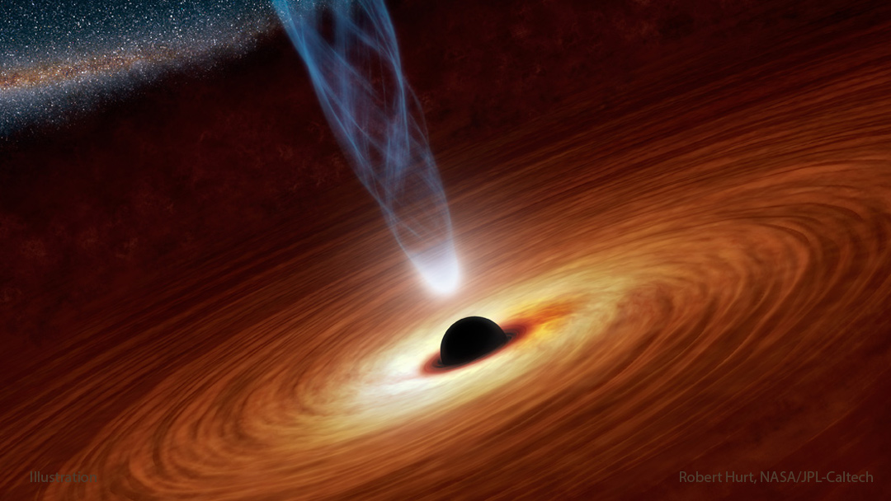

# Space Explorer

A Node.js command-line application that integrates with various space-related APIs to provide real-time and historical space data.

## Features

- NASA Astronomy Picture of the Day (APOD)
- International Space Station (ISS) location tracking
- Upcoming space launches information

## API Sources

- NASA APOD API
- Open Notify ISS Location API
- Launch Library 2 API

## Testing

Run tests using:

```bash
npm test
```
## Sample Output

the output of what the nasa api shows.

- Image of the day.
  


- The Image shown.
  


- ISS Live Location & The upcoming launches.
  

